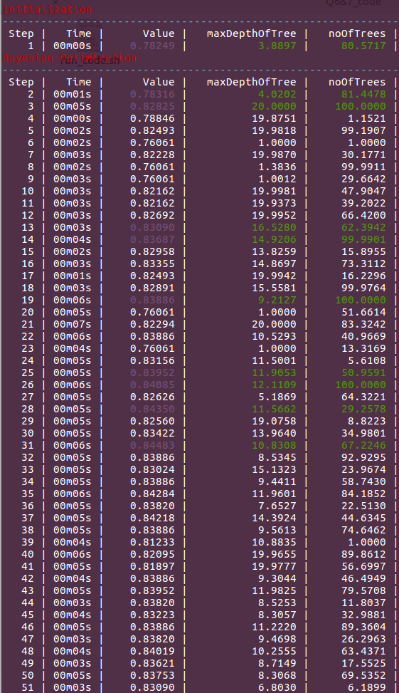
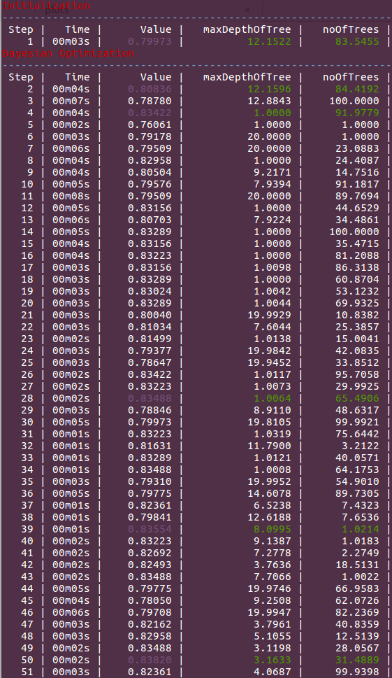

# BayesianOptimization-bayes_opt

Library: https://github.com/fmfn/BayesianOptimization  

With Bagging:  
Best accuracy of ~84% on validation set is seen with max depth of 67 and no. of trees.
Other hyper-parameter values which achieve similar results vary and are not at all
similar. Hence, this means that the combination of the values of the parameters matters
more than tweaking the individual values.  

With Boosting:  
Best accuracy of ~84% on validation set is seen with max depth of 3 and 31 no.
boosting iterations.  
The Boosting learning algorithm tries to fit smaller trees (weak classifiers) and slowly
improve the ensemble classifier by additive expansion for approximation of the
classification function.

BO on Bagging:  
  

BO on Boosting:  
  

